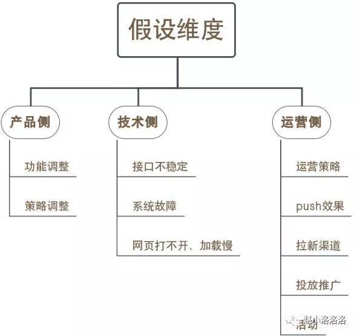

leetcode: 83 84 92 95 96 105 106 110

### 1. 类比到头条的收益，头条放多少广告可以获得最大收益？
收益 = 出价x流量x点击率x有效转化率，放广告的数量会提高流量，但会降低匹配程度，因此降低点击率。

最大收益是找到这个乘积的最大值，是一个有约束条件的最优化问题。
同时参考价格歧视方案，可以对不同的用户投放不同数量的广告。

### 2. 不用任何公开参考资料，估算今年新生儿出生数量？
采用两层模型（人群画像x人群转化）：新生儿出生数=Σ各年龄层育龄女性数量*各年龄层生育比率（两层模型，具有两个层面的模型。）。

从数字到数字：根据前几年新生儿出生数量数据，建立时间序列模型（需要考虑到二胎放开的突变事件）进行预测。

找关联指标，如婴儿类用品新增用户是新生儿出生的关联指标。新生儿出生数=某宝平台的婴儿类用品的新增活跃用户数量/新生儿家庭转化率。可以根据平台往年数据推算出新生儿家庭转换率，最后得出新生儿出生数。

### 3. 如果一天日活（DAU, daliy active user）突然下降了 你要怎么寻找原因 为什么这么做 ？
http://www.woshipm.com/data-analysis/2467030.html
核心点：先做数据异常原因的假设，后用数据验证假设。

第一步：确认数据真实性 (显示问题，SQL查询问题，日志问题)

第二步：根据几个常见维度初步拆分数据

常见的几个维度：

拆用户：新老用户

拆登录平台：ios/安卓

拆版本：新老版本

拆入口：点击图标登入、push调起等

拆登录渠道：app，微信小程序，pc端，M端等

拆区域：省份国家等

拆时间：淡旺季、日夜、周期性产品等

计算影响系数：每一项数据都要和以往正常值做对比，算出影响系数。

影响系数=(今日量-昨日量)/(今日总量-昨日总量)

影响系数越大，说明此处就是主要的下降点

以上是几种常见的初步拆分维度，通过初步拆分，定位原因大致范围。

第三步：异常范围定位后，进一步做假设
针对初步定位的影响范围，进行进一步的排查。分三个维度来做假设，建议针对数据异常问题专门建一个群，拉上相应的产品、技术、运营人员一起，了解数据异常时间点附近做了什么产品、运营、技术侧调整。最后根据以往经验来假设最可能出现的原因。

第四步：细分假设，确立原因

除了上述，可以细分分析的维度实在太多，逻辑上说核心点在于一个假设得到验证后，在这个假设为真的基础上，进行更细维度的数据拆分。我们需要记住这种分析方式，当猜测是某种原因造成数据异常时，只要找到该原因所代表的细分对立面做对比，就可以证明或证伪我们的猜测，直到最后找到真正原因。

### 4. 如果次日用户留存率下降了 5%该怎么分析？

首先采用“两层模型”分析：对用户进行细分，包括新老、渠道、活动、画像等多个维度，
然后分别计算每个维度下不同用户的次日留存率。
通过这种方法定位到导致留存率下降的用户群体是谁。

对于目标群体次日留存下降问题，具体分析可以采用“内部-外部”因素考虑。
a. 内部因素分为获客（渠道质量低、活动获取非目标用户）、满足需求（新功能改动引发某类用户不满）、提活手段（签到等提活手段没达成目标、产品自然使用周期低导致上次获得的大量用户短期内不需要再使用等）；
b. 外部因素采用PEST分析（宏观经济环境分析），政治（政策影响）、经济（短期内主要是竞争环境，如对竞争对手的活动）、社会（舆论压力、用户生活方式变化、消费心理变化、价值观变化等偏好变化）、技术（创新解决方案的出现、分销渠道变化等）

留存与否 binary 分类， 二叉树 找到关键的feature （某个地区之类的，那么该地区可能大规模新用户注册了不用，广告）

### 5. 卖玉米如何提高收益？价格提高多少才能获取最大收益？

收益 = 单价*销售量，那么我们的策略是提高单位溢价或者提高销量。

提高单位溢价的方法：
品牌打造获得长期溢价，但缺陷是需要大量前期营销投入；
加工商品占据价值链更多环节，如熟玉米、玉米汁、玉米蛋白粉；
重定位商品，如礼品化等；
价格歧视，根据价格敏感度对不同用户采用不同定价。

销售量=流量x转化率，上述提高单位溢价的方法可能对流量产生影响，也可能对转化率产生影响。
收益 = 单价x流量x转化率，短期内能规模化采用的应该是进行价格歧视，如不同时间、不同商圈的玉米价格不同，采取高定价，然后对价格敏感的用户提供优惠券等。

### 6. 类比到头条的收益，头条放多少广告可以获得最大收益？

收益 = 出价x流量x点击率x有效转化率，放广告的数量会提高流量，但会降低匹配程度，因此降低点击率。

最大收益是找到这个乘积的最大值，是一个有约束条件的最优化问题。
同时参考价格歧视方案，可以对不同的用户投放不同数量的广告。

### 7. 用户刚进来APP的时候会选择属性，怎样在保证有完整用户信息的同时让用户流失减少？

采用技术接受模型（TAM）来分析，影响用户接受选择属性这件事的主要因素有：
技术接受模型提出了两个主要的决定因素：
1）感知的有用性(perceived usefulness)，反映一个人认为使用一个具体的系统对他工作业绩提高的程度；
感知有用性：文案告知用户选择属性能给用户带来的好处
2）感知的易用性(perceived ease of use)，反映一个人认为容易使用一个具体的系统的程度。
a. 关联用户第三方账号（如微博），可以冷启动阶段匹配用户更有可能选择的属性，推荐用户选择。
b. 交互性做好。
3）使用者态度：用户对填写信息的态度
a. 这里需要允许用户跳过，后续再提醒用户填写
b. 告知用户填写的信息会受到很好的保护
4）行为意图：用户使用APP的目的性，难以控制
5）外部变量：如操作时间、操作环境等，这里难以控制

### 8. 如何识别作弊用户（爬虫程序， 或者渠道伪造的假用户）
分类问题可以用机器学习的方法去解决，下面是我目前想到的特征：
（1）渠道特征：渠道、渠道次日留存率、渠道流量以及各种比率特征
（2）环境特征：设备（一般伪造假用户的工作坊以低端机为主）、系统（刷量工作坊一般系统更新较慢）、wifi使用情况、使用时间、来源地区、ip是否进过黑名单
（3）用户行为特征：访问时长、访问页面、使用间隔、次日留存、活跃时间、页面跳转行为（假用户的行为要么过于一致，要么过于随机）、页面使用行为（正常用户对图片的点击也是有分布的，假用户的行为容易过于随机）
（4）异常特征：设备号异常（频繁重置idfa）、ip异常（异地访问）、行为异常（突然大量点击广告、点赞）、数据包不完整等

### 9. 怎么做恶意刷单检测?

分类问题用机器学习方法建模解决，我想到的特征有：
1）商家特征：商家历史销量、信用、产品类别、发货快递公司等
2）用户行为特征：用户信用、下单量、转化率、下单路径、浏览店铺行为、支付账号
3）环境特征（主要是避免机器刷单）：地区、ip、手机型号等
4）异常检测：ip地址经常变动、经常清空cookie信息、账号近期交易成功率上升等
5）评论文本检测：刷单的评论文本可能套路较为一致，计算与已标注评论文本的相似度作为特征
6）图片相似度检测：同理，刷单可能重复利用图片进行评论

### 10.一个网站销售额变低，你从哪几个方面去考量？

首先要定位到现象真正发生的位置，到底是谁的销售额变低了？这里划分的维度有：
a. 用户（画像、来源地区、新老、渠道等）
b. 产品或栏目
c. 访问时段
定位到发生未知后，进行问题拆解，关注目标群体中哪个指标下降导致网站销售额下降：
a. 销售额=入站流量x下单率x客单价
b. 入站流量 = Σ各来源流量x转化率
c. 下单率 = 页面访问量x转化率
d. 客单价 = 商品数量x商品价格
确定问题源头后，对问题原因进行分析，如采用内外部框架：
a. 内部：网站改版、产品更新、广告投放
b. 外部：用户偏好变化、媒体新闻、经济坏境、竞品行为等. 

### 11.用户流失的分析，新用户流失和老用户流失有什么不同？
1）用户流失分析：

两层模型：细分用户、产品、渠道，看到底是哪里用户流失了。**注意由于是用户流失问题，所以这里细分用户时可以细分用户处在生命周期的哪个阶段。（用户生命周期：引入，成长，成熟，休眠，流失**。）
指标拆解：用户流失数量 = 该群体用户数量*流失率。拆解，看是因为到了这个阶段的用户数量多了（比如说大部分用户到了衰退期），还是这个用户群体的流失率比较高
内外部分析：
a. 内部：新手上手难度大、收费不合理、产品服务出现重大问题、活动质量低、缺少留存手段、用户参与度低等
b. 外部：市场、竞争对手、社会环境、节假日等
2）新用户流失和老用户流失有什么不同：

新用户流失：原因可能有非目标用户（刚性流失）、产品不满足需求（自然流失）、产品难以上手（受挫流失）和竞争产品影响（市场流失）。
新用户要考虑如何在较少的数据支撑下做流失用户识别，提前防止用户流失，并如何对有效的新用户进行挽回。

老用户流失：原因可能有到达用户生命周期衰退期（自然流失）、过度拉升arpu导致低端用户驱逐（刚性流失）、社交蒸发难以满足前期用户需求（受挫流失）和竞争产品影响（市场流失）。
老用户有较多的数据，更容易进行流失用户识别，做好防止用户流失更重要。当用户流失后，要考虑用户生命周期剩余价值，是否需要进行挽回。

### 12.GMV升了20%怎么分析？

应该先估算一下数字有没有问题。

同样的套路：
1）两层模型：进行用户群体、产品、渠道细分，发现到底是谁的GMV提升了
2）指标拆解：将GMV拆解成乘法模型，如GMV=广告投放数量广告点击率产品浏览量放入购物车率交易成功率*客单价，检查哪一步有显著变化导致了GMV上升
3）内外部分析：
a. 内部：网站、产品、广告投放、活动等
b. 外部：套PEST等框架也行，或者直接分析也行，注意MEMC即可

这一题要注意，GMV流水包括取消的订单金额和退货/拒收的订单金额，还有一种原因是商家刷单然后退货，虽然GMV上去了，但是实际成交量并没有那么多。

### 13. 如果现在有个情景，我们有一款游戏收入下降了，你怎么分析？

两层模型：细分用户、渠道、产品，看到底是哪里的收入下降了
指标拆解：收入 = 玩家数量 * 活跃占比 * 付费转化率 * 付费次数 * 客单价
进一步细分，如玩家数量 = 老玩家数量 * 活跃度 + 新玩家数量 * 留存率等。然后对各个指标与以往的数据进行对比，发现哪些环节导致收入下降
原因分析：
a. 内部：产品变化、促活活动、拉新活动、定价策略、运营策略、服务器故障等
b. 外部：用户偏好变化、市场环境变化、舆论环境变化、竞争对手行为、外部渠道变化等
如何提高：基于乘法模型，可以采用上限分析，从前往后依次将指标提升到投入足够精力（假设优先分配人力、经费与渠道）后的上限，然后分析“收入”指标的数值提升。找到数值提升最快的那个阶段，就是我们提高收入的关键任务。

### 14. 现在有一个游戏测试的环节，游戏测试结束后需要根据数据提交一份PPT，这个PPT你会如何安排？包括什么内容？
这里可以套AARRR模型：
获取用户（Acquisition）
提高活跃度（Activation）
提高留存率（Retention）
获取收入（Revenue）
自传播（Refer）

获取：我们的用户是谁？用户规模多大？
a. 用户分层
激活：游戏是否吸引玩家？哪个渠道获取的用户有质量（如次日留存高、首日停留时间长等）？
留存：用户能否持续留存？哪些用户可以留存？
转化：用户的游戏行为如何？能否进行转化？能否持续转化？
自传播：用户是否会向他人推荐该游戏？哪种方式能有效鼓励用户推荐该游戏？传播k因子是否大于1？

47.用户生命周期 AARRR

1) Acquisition
如何低成本的获客、怎么打动用户、抓住用户的吸引力

2) 激活 Activation
如何避免注册多、打开少，让用户称为产品真正的使用者
用户的激活路径是怎样的？用户在哪一步流失？怎么提升转化率？
配合一些策略：补贴、发push唤醒用户

3) 留存 Retention
让用户养成使用产品的习惯，对于用户的生命周期有不同的策略

4) 变现 Revenue
根据商业模式的不同，创造收益的方式也不同。
今日头条：通过创造广告位、雇佣写手创造更多内容
电商：直接购买
需要重视的是，夹点。指的是用户损失潜在收益的地方，比如电商购买付费的路径，分析用户在哪一步停止付钱。

5) 推荐 Reference

### 15. 中心极限定理作用 大数定理 置信区间

### 16. app里要上线一个广告位
如果app里要上线一个广告位 你怎么设计方案验证要不要上线这个广告位 ？ 如果已知此广告位会带来100万的收益 ，CAC（Customer Acquisition Cost 用户获取成本）= 6 但是会使每日的留存率降低1% 用数学公式计算要不要上线此广告位 ？如果上线了此广告位 问哪一天日活达到最大 ？

是否上线广告位，我们需要考虑整体收益最大化，不能仅仅只考虑有形资本，还要考虑无形资本。上线广告位，我们可以获得收益，但是会造成客户的流失，客户流失之后我们还需要付出成本获取用户。在保证用户数不变的情况下，不上线广告位和上线广告位的整体收益如下：

不上线广告位：

app里的资本 = 用户数*平均每用户的生命周期价值。

上线广告位之后：

app里的资本 = 广告位收益 - 获客成本*流失用户数 +不上线广告位时的用户数*平均每用户的生命周期价值

如若想在广告位中获利，即上线广告位之后的资本 > 上线广告位之前的资本。即广告位收益 – 获客成本 *流失用户数 > 0 时可以选择上线广告位，否则上线广告位就亏本了。

代入数据可知，当流失用户数 > 100万/6 时，此时用户上线广告位是亏本状态。而流失用户的数量与产品用户总量和广告展示天数有关，所以上线广告位是否获得收益需要具体分析产品用户数和广告展示天数获得流失用户数才能知道是否能盈利。

日活最大的一天是上线广告位当天，之后用户的留存就会逐渐降低。
